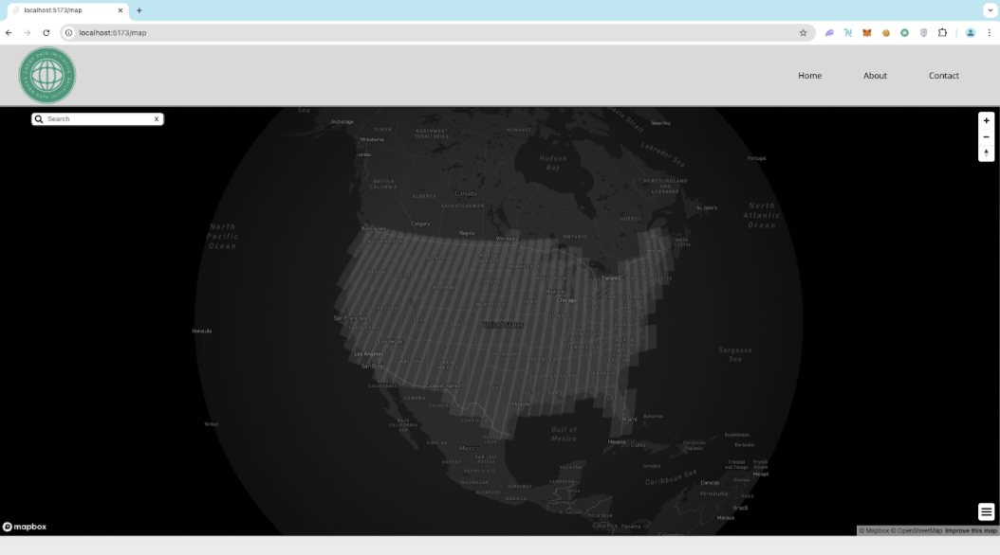
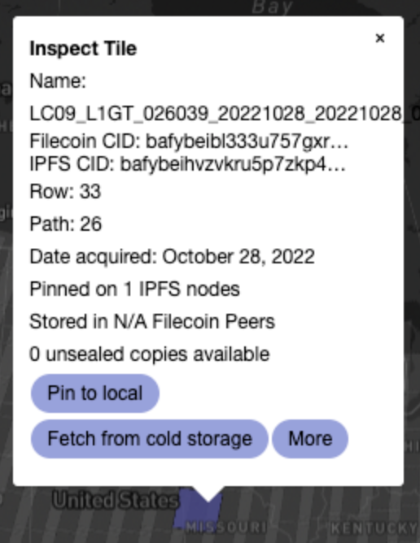
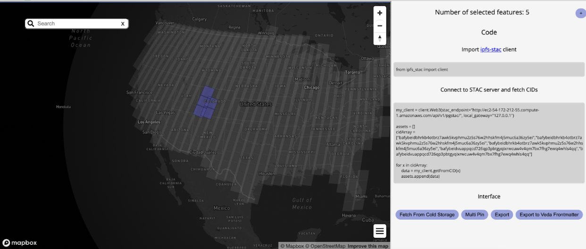
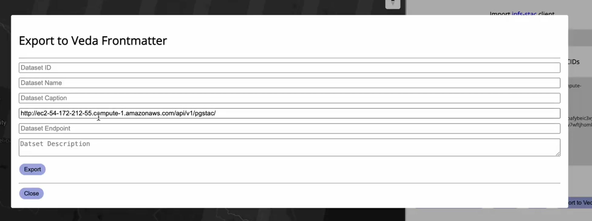
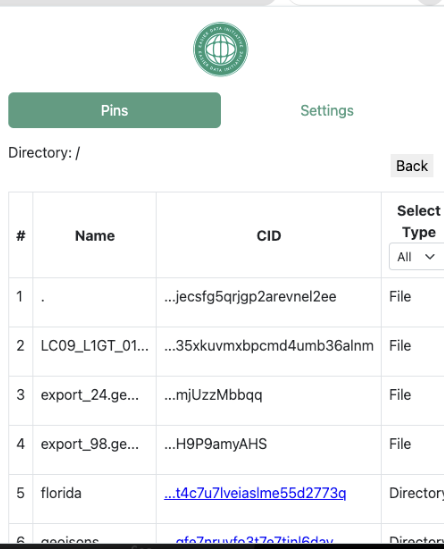

# Features

## GeoJSON Visualization

When reaching the landing page of the dashboard, users will be presented with a card and two text fields that prompt for a STAC API URL, and optionally, a Geojson endpoint. Upon submission of the form, users will be redirected to a screen that renders the topology with MapboxGL. By default, the application supports searching for points of interest, pinching, zooming, rotating, and clicking on scenes.

## Scene Popups

When clicking on a scene, the event triggers a handler within the chrome extension. This event handler will send a request to the configured IPFS Node and Dashboard API to retrieve IPFS and Filecoin related metadata respectively. The results will then be congregated onto a scene popup. This popup also allows other interactions to be performed such as pinning the data to the configured IPFS node. Clicking on *more* will reveal a popup that instructs on how to integrate the selected data into a python program leveraging ipfs-stac.

## Multi Select

The dashboard supports selecting multiple scenes at once through holding shift and drag clicking across scenes. This would render a sidebar allowing users to integrate the data into their Python programs, pin the data, export to a new GeoJSON, and bring up a template generator to export NASA VEDA frontmatter (shown below):

## Extension

The extension itself allows users to interact with the data and directories that exist within the nodes configured mutable file system (MFS). Folders are explorable by clicking on their links, data is filterable and deletable.
