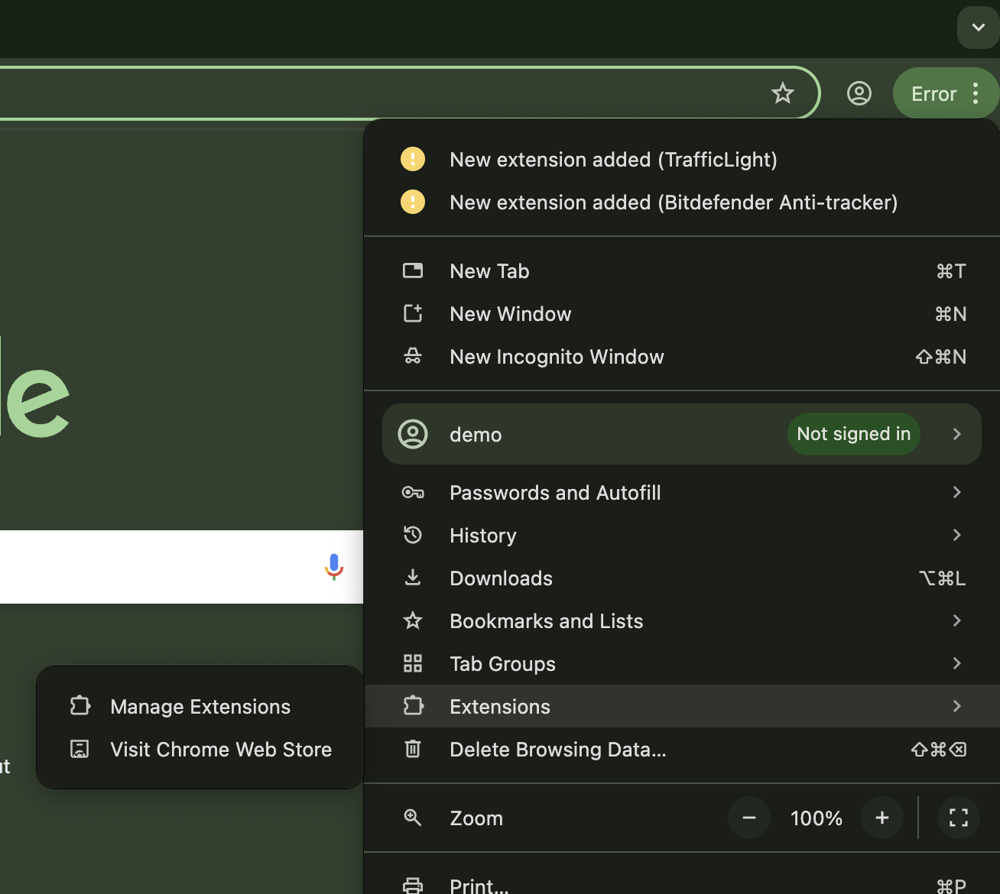
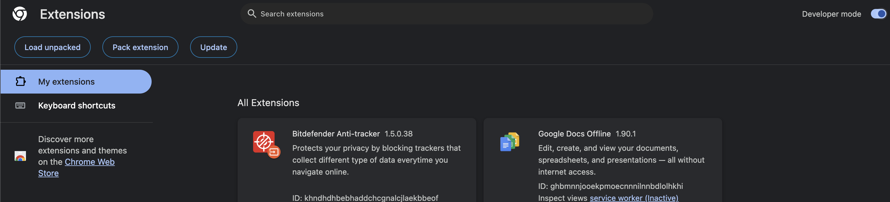
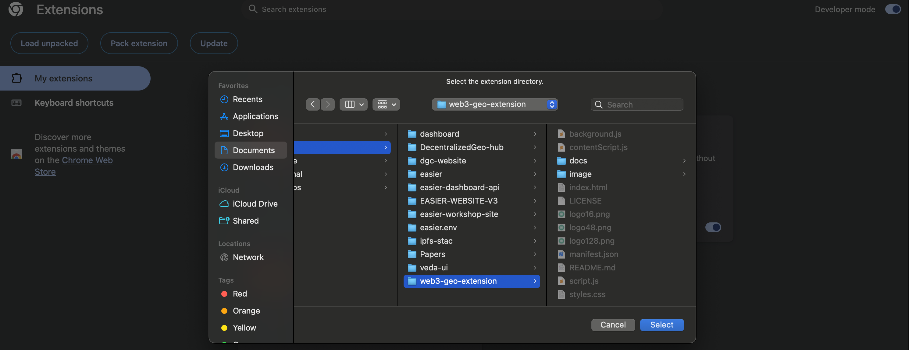
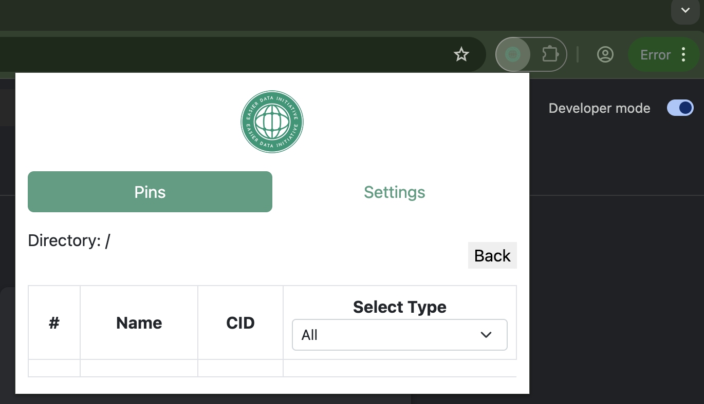
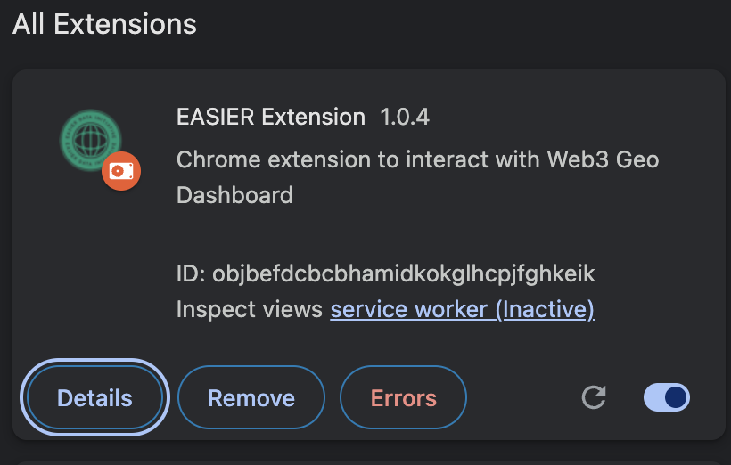
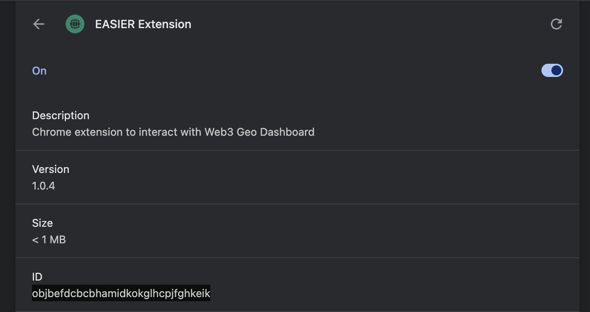

# How to setup chrome extension

## Introduction

One of the key components for unlocking the full potential of the Web3 geospatial dashboard is the chrome extension. The tool is powerful as it connects basic interactions (such as clicks) to a configured IPFS node. To this point, it mocks some features of the IPFS desktop experience remotely. This means that nodes that are not ran through IPFS desktop but have Kubo exposed can be interfaced with in a similar way. The extension offers the ability to explore the mutable file system, pin data, delete, etc.

This page assumes you have already set up a node that exposes a Kubo RPC API. This walk through will explore configuring the extension with a node hosted on a personal device (IPFS Desktop).

## Adding the extension to Chrome

First, clone the [web3-geo-extension repository](https://github.com/DecentralizedGeo/web3-geo-extension).

In a fresh Chrome window, click on the top right 3 dots and hover over **E****xtensions.** In the popup, click on **Manage Extensions**.

This will bring up the extension settings page. At the top right, toggle on **Developer mode**

Following this, click on the **Load Unpacked** button. This will bring up your system's file manager. Navigate to where you cloned the `web3-geo-extension` repository and confirm the selection.

When you see the "EASIER Extension" card on the page loaded, you have successfully loaded the extension to Chrome!

## Configure Node

The extension must be configured to a node in order to begin pinning data and exploring the mutable file system. To configure the extension to talk to a local IPFS Desktop instance, first click on the extension icon at the top right of your Chrome window (you may have to click on the puzzle piece to find it) to bring up the extension popup:

Click on the settings page and configure the following settings:

* **IP/Domain:** `localhost`
* **Port**: `5001`
* **MFS Directory:** `/root` (this can be any name but must start with a `/`)

Click on save. A popup should render saying the configuration has been saved successfully. This is the last step for setting up the extension.

## Allow Requests from Extension

To accept requests from the extension within a local instance of IPFS Desktop, the configuration of the node must be updated. In the extensions settings page of chrome click on **Details** for the EASIER extension.

Copy the ID

In your IPFS Config, add the extension to the `Access-Control-Allow-Origin` list. The format for an extension is: `chrome-extension://<EXTENSION ID>`. In this case, it would be `chrome-extension://objbefdcbcbhamidkokglhcpjfghkeik`. Reference the IPFS Desktop setup guide for more details.
