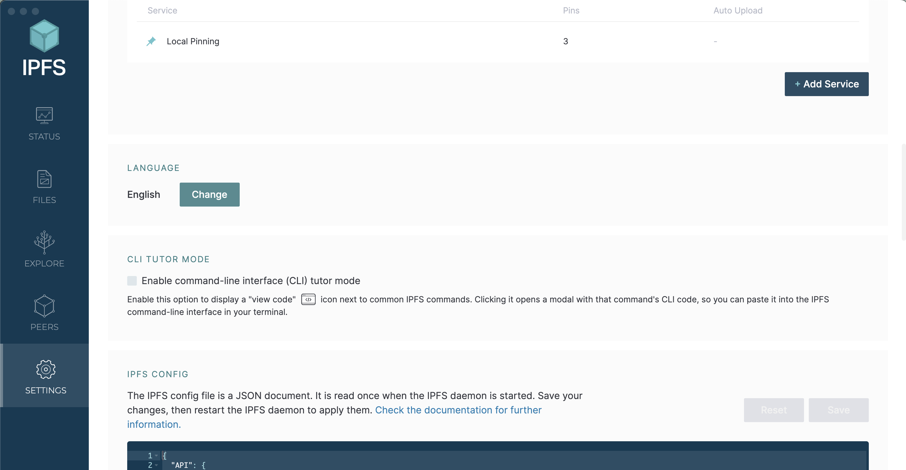

# How to setup IPFS Desktop

## Introduction

If you're new to the IPFS ecosystem, chances are you are confused on how to get started with storing and retrieving data. Moreover, if you're a developer, it's likely you lack a sense of direction on how to get started building tools that interface with IPFS--there are so many APIs such as Web3.storage that exist, picking between so many options is hard! Meet <a href="https://docs.ipfs.tech/install/ipfs-desktop/#windows" target="_blank">IPFS Desktop</a>. IPFS desktop is an open-source tool built by the IPFS team that bundles a node, file manager, and other tools in an easy-to-use interface. This is a great gateway to kickstart your IPFS journey as a user and/or developer without having to sign up for any services.

This page will cover the steps after installing IPFS desktop to setup your instance for development and testing with the Web3 Geospatial Dashboard. Parts of this setup process is applicable to other applications as well (if you choose to build or use other apps).

## Install IPFS Desktop

The installation process of getting IPFS desktop installed has been documented by the IPFS team. Follow the directions depending on which operating system you are working with:

1. <a href="https://docs.ipfs.tech/install/ipfs-desktop/#windows" target="_blank">Windows</a>
2. <a href="https://docs.ipfs.tech/install/ipfs-desktop/#macos" target="_blank">macOS</a>
3. <a href="https://docs.ipfs.tech/install/ipfs-desktop/#ubuntu" target="_blank">Ubuntu</a>

## Update Access Control Headers

When editing the `Access-Control-Allow-Origin` list in your IPFS Config. You edit which domains can hit your node's IPFS <a href="https://docs.ipfs.tech/reference/kubo/rpc/" target="_blank">Kubo RPC API</a>. This API allows the node to be controlled through HTTP requests and has feature parity with both IPFS Desktop and the <a href="https://docs.ipfs.tech/install/command-line/#system-requirements" target="_blank">IPFS CLI</a>. To access the access control header settings and your IPFS Config, navigate to the last section under the settings tab within IPFS Desktop:



As an example, say you wanted to grant `https://dashboard.easierdata.org` access to hit the Kubo RPC API, you would add it to the list:

**Before**

```json
{
	"API": {
		"HTTPHeaders": {
			"Access-Control-Allow-Origin": [
				"https://webui.ipfs.io",
				"http://webui.ipfs.io.ipns.localhost:8080"
			]
		}
	}
	...
}
```

**After**

```json
{
	"API": {
		"HTTPHeaders": {
			"Access-Control-Allow-Origin": [
				"https://webui.ipfs.io",
				"http://webui.ipfs.io.ipns.localhost:8080",
				"https://dashboard.easierdata.org"
			]
		}
	}
	...
}
```

To add other domains, simply repeat this process and change what is inserted with the domain of interest. **Be sure to not tamper the default values**. In the case you want *all traffic* to be accepted by your node, use the wildcard value: `*`. **This is not recommended.**
