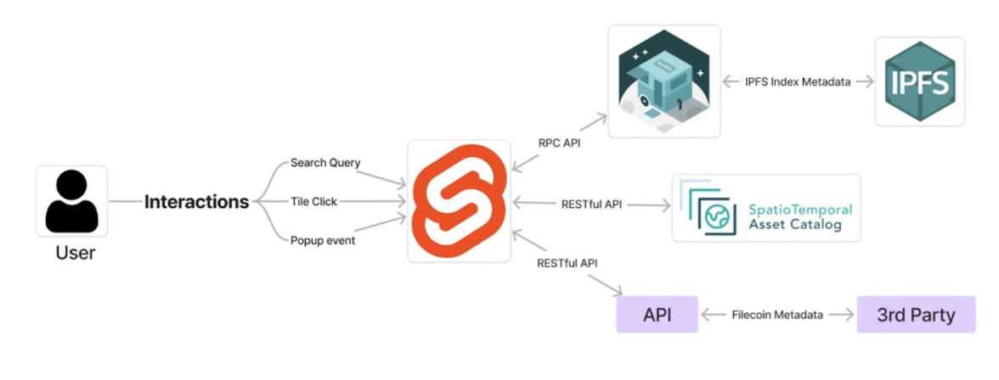

# Tech Stack

The figure above showcases how all the components behind the dashboard are interconnected. Traversing the visual from left-to-right highlights how inputs connect to components on the backend. Users begin with pointing the dashboard to a STAC API enriched with IPFS and Filecoin metadata along with a Geojson. Upon entering these details, a map topology that parallels the inputted geojson is rendered. The map is configured to handle interactions from the user such as clicking on geometry, buttons on pop-ups, and more. The various interactions all trigger event listeners to communicate with the backend infrastructure to fetch the accompanying metadata and other details. Svelte accesses this metadata through three channels, <a href="https://github.com/ipfs/kubo" target="_blank">kubo</a>, the configured STAC API, and another API which poses as a middle man between the dashboard and other resources such as <a href="https://cid.contact/" target="_blank">CID.Contact</a>.
